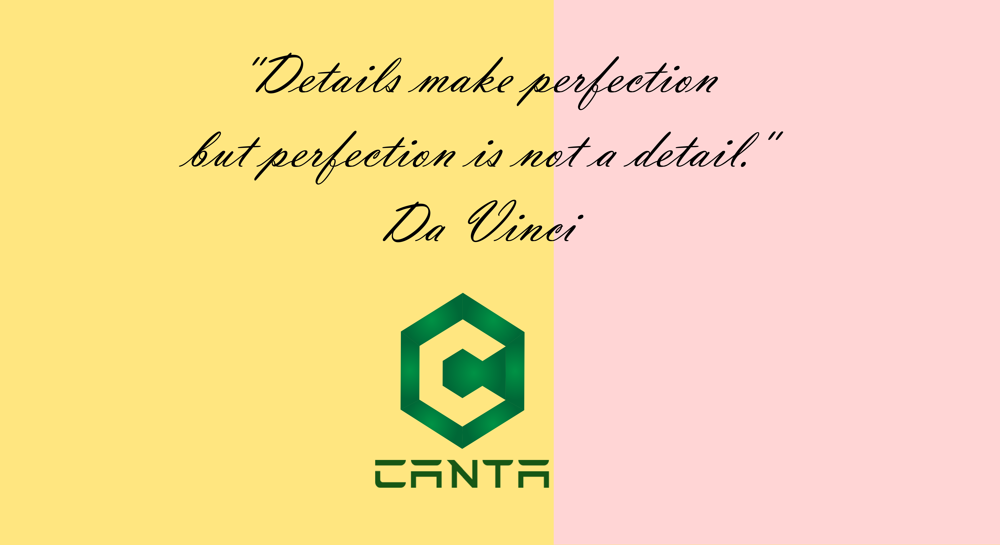
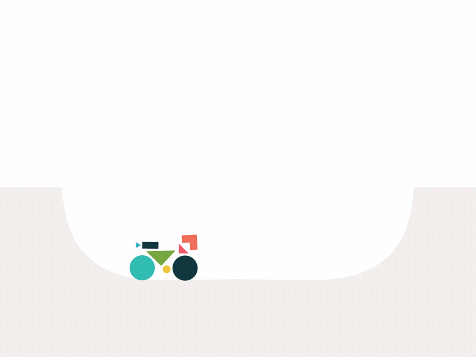

  
  <h1>Hi, I'm Dr. Adama NDOUR</h1>
  <h3>A Data scientist and a passionate full-stack web developer.</h3>

 

- 🌱 I’m currently working **at ICRISAT** 

- 🔭 I’m currently working on **machine learning, deep learning and signal processing** projects

- 🌱 I’m currently learning JavaScript Frameworks such as **React, Redux and Node.js** 

- 👯 I’m looking to collaborate on JavaScript, React, and AI end-to-end projects.

- 🤝 I’m looking for help in developing **machine learning web applications**

- 👨‍💻 All of my projects are available at [Github](https://github.com/adamavip)

- 💬 Ask me about **Plant Phenotyping and modeling of complex systems 😆**

- ⚡ Fun fact: **It’s all 0’s and 1’s**
 

 
<h3> 👱 Visitors count </h3>

<h2><u><b>Knowledge Base</b></u></h2>

<h3>Languages</h3>

  
  
  
  
  
   

<h3>📚 Frontend</h3>

      
  
   
  
  

<h3>🍗 Machine Learning / Deep Learning</h3>
 
  
  
  
  
  
  
  

<h3>📚 Backend</h3>

    
   

 
<h3>💾 Databases</h3>

  
   

### 🎨 Design

  
  
  
  
  

<h3>🎈 Cloud & Hosting:</h3>

  
   

<h3>🎷 Version Control & CI/CD</h3>

  
  

<h3>💻 IDEs/Editors :</h3>

  
  
  
  
  
  

----

<h3>Connect with me</h3>

  

    
    
  

<h3>Reach me</h3>

  

  

  

<h2> Github's Status </h2>

   

  

<h3> Happy Coding! 😊 </h3>

